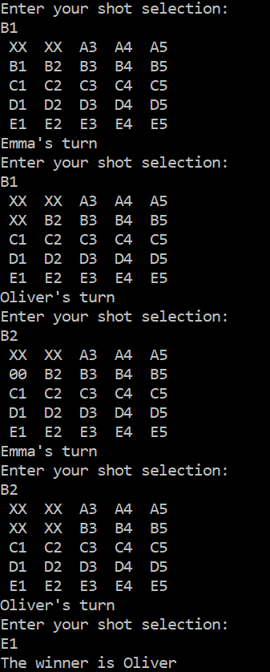

# Battleship lite game

#### 🧪

#### 📝 Description
Battleship lite is a guessing game for two players. It works similarly to the normal Battleship game. It's played on a 5x5 grid on which each player's ships are marked. Each player places 1x1 ship five times, whose position must be hidden from the opponent. Players alternate shooting at each other's ships. The first player to shoot down all enemy ships wins.

#### 🛠️ Built with
 * C#
